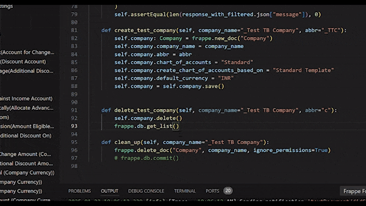
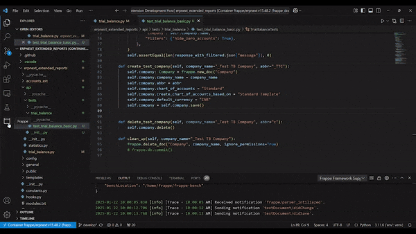

# Frappe Framework Support for VSCode
this addin provides suggestions, code snippets etc  based on data from installed frappe apps
This addin will load if you have bench installed in current environment

# Frappe TreeView
In this view we can see the apps installed in your current bench directory, along with modules, doctypes appwise and we provide suggestion based on this data

# Preview
This addin is still in development so still we are adding features which can be tracked though [issues](https://github.com/saivineeth100/frappe-vscode/issues) are planned features [here](https://github.com/users/saivineeth100/projects/1) and if you want suggest some features you can suggest in [discussions](https://github.com/saivineeth100/frappe-vscode/discussions/categories/ideas)
